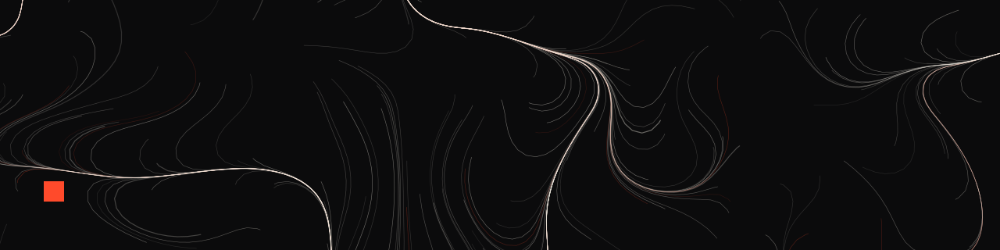

<picture>
  <source media="(prefers-color-scheme: dark)" srcset="assets/banner-dark.svg">
  <source media="(prefers-color-scheme: light)" srcset="assets/banner-light.svg">
  
</picture>

# always1ov

**一直走，一直写。**

这里是我的个人网站的全部源码 —— 不是博客平台上的一个账号，是一个我自己能改到每一个像素的地址。

**→ [always1ov.pages.dev](https://always1ov.pages.dev)**

---

## 这是什么

一个用 [Valaxy](https://valaxy.site)（Vue 3 + Vite）搭的静态站点。**主题不是装来的，是这个仓库里的 `theme/` 目录**，从一行 CSS 一个组件写出来的，叫 `valaxy-theme-always`。

它长这样，是因为做了这些决定：

| 决定 | 为什么 |
| --- | --- |
| 只有两种颜色：墨与纸，加一点朱砂红 | 每多一种颜色，重点就少一分 |
| 中文不加载网络字体 | 一套中文字体动辄 3~8 MB，不值得让所有人多等两秒 |
| 首屏那片东西是当场画出来的 | 一条不抬笔的线，正好就是 always 的字面意思 |
| 没有评论、没有统计、没有 cookie 提示 | 因为没有 cookie |

细节写在这两篇里：[给 Valaxy 写一个只属于自己的主题](https://always1ov.pages.dev/posts/valaxy-custom-theme)、[这个站长这样，是有原因的](https://always1ov.pages.dev/posts/design-notes)。

## 本地跑起来

需要 Node ≥ 22.12。

```bash
npm install
npm run dev      # http://localhost:4859
npm run build    # 产物在 ./dist
```

## 目录长什么样

```
.
├── pages/              # 内容。写文章就是往这加 markdown
│   ├── index.md        #   首页「自述」那段
│   ├── about.md
│   └── posts/*.md
├── theme/              # 主题 valaxy-theme-always（不是依赖，是源码）
│   ├── layouts/        #   home / post / archives / tags / 404
│   ├── components/     #   首屏画布、命令面板、目录、条目行…
│   ├── styles/         #   设计系统：token、排版、组件
│   └── types/          #   主题配置的类型
├── valaxy.config.ts    # 主题配置 + 自定义的 Shiki 配色
├── site.config.ts      # 站点元信息
└── scripts/banner.mjs  # 生成上面那张横幅
```

## 写一篇新文章

在 `pages/posts/` 下新建一个 markdown：

```markdown
---
title: 标题
date: 2026-08-21
tags: [随笔]
description: 列表里显示的那句话。不写会自动摘录第一段。
---

正文。
```

推到 `main`，GitHub Actions 会构建并部署到 Cloudflare Pages。

## 部署

需要在仓库里配三个值：

| 位置 | 名称 |
| --- | --- |
| Settings → Secrets | `CLOUDFLARE_API_TOKEN` |
| Settings → Secrets | `CLOUDFLARE_ACCOUNT_ID` |
| Settings → Variables | `CLOUDFLARE_PROJECT_NAME` |

---

<sub>文章依 [CC BY-NC-SA 4.0](https://creativecommons.org/licenses/by-nc-sa/4.0/deed.zh) 共享，代码依 MIT 开源。</sub>
